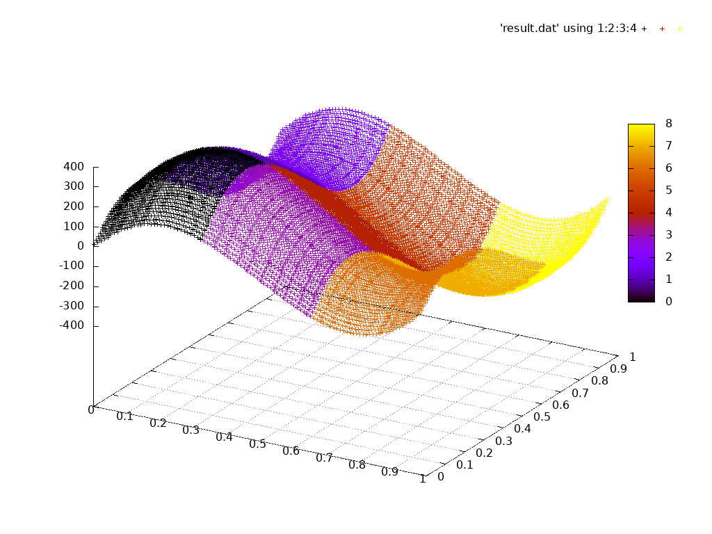

# JacobiChallenge - MPI

## MPI
This version works by doing a domain-decomposition in x and y direction.

Change the size using the defines in the ``mainMPI.c``.

For execution use the script ``meluxina.sh``.
Set -N to the number of nodes that should be reserved  and --tasks to the number of MPI-tasks that should be started.

```
sbatch ./meluxina.sh
```
Here each of the used 9 cores (resulting in a 3x3 grid) gets its own color:


## How to compile and run

module load OpenMPI/4.1.4-GCC-11.3.0
module load gnuplot
module unload OpenSSL

make

srun --mpi=pmix -n <numOfTasks> jacobiMPI
gnuplot ./result.plot
